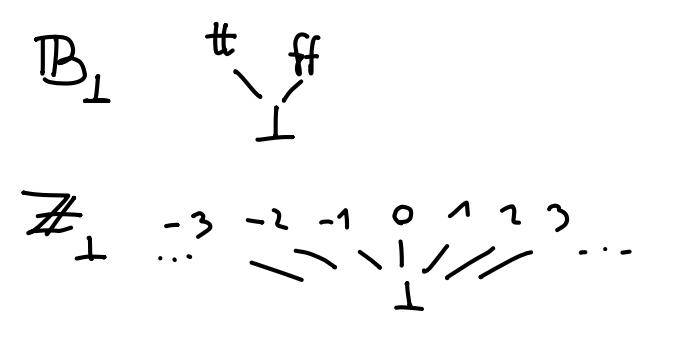
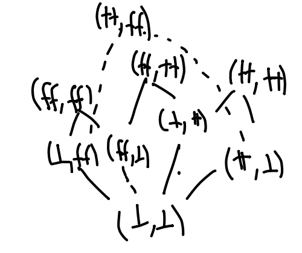

# Domene

Pri interpretaciji izrazov nismo omenjali rekurzije. Spomnimo se, da jo lahko uvedemo z izrazom $\kwdpre{rec} f \, x . M$, za katerega velja

$$
    \infer{}{
        (\kwdpre{rec} f \, x . M) \, V \leadsto M[V / x, (\kwdpre{rec} f \, x . M) / f]
    }
$$

Če bi želeli skladnost denotacijske semantike z operacijsko, bi torej moralo veljati

$$
    \itp{(\kwdpre{rec} f \, x . M)}(\itp{V}) = \itp{M}(\itp{V}, \itp{\kwdpre{rec} f \, x . M})
$$

Na primer, če za $M$ vzamemo $x + \intsym{1}$, za $V$ pa $\intsym{0}$, dobimo

$$
    \itp{(\kwdpre{rec} f \, x . f \, x + \intsym{1}) \, \intsym{0}} = \itp{(\kwdpre{rec} f \, x . f \, x + \intsym{1}) \, \intsym{0}} + 1
$$

kar seveda ni res. V splošnem pa nam enačba pove, da ima (malo preurejeni) $\itp{M}$ vedno fiksno točko. To za množice in preslikave med njimi seveda ne velja. Smo pa fiksne točke že konstruirali v poglavju o indukciji, kjer smo imeli monotono preslikavo na množicah $F$, ki smo jo iterirali na prazni množici $\emptyset$, da smo dobili množico $I = \bigcup_{n = 0}^{\infty} F^i(\emptyset)$, za katero je veljalo $F I = I$. Podoben postopek želimo narediti v splošnem, kar nas pripelje do definicije _domen_.

## Domene

Zaporedje $(x_i)_{i \in \mathbb{N}}$ v delno urejeni množici $D$ je _veriga_, če za vsak $i \in \mathbb{N}$ velja $x_i \le x_{i + 1}$.

Delno urejena množica $(D, \le)$ je _domena_, če:

- obstaja najmanjši element $\bot_D$, ki ga imenujemo _dno_, za katerega velja $\bot_D \le x$ za vsak $x \in D$.
- ima vsaka veriga $(x_i)_i$ natančno zgornjo mejo, ki jo označimo z $\bigvee_i x_i$.

Primeri domen so:

- Interval $[0, 1]$ ali pa $[0, 1) \cup \{2\}$ z običajno urejenostjo $\le$. Interval $(0, 1]$ ni domena, ker nima dna, interval $[0, 1)$ pa ne, ker veriga $(1 - \frac{1}{i + 1})_i$ nima supremuma.
- Vsako množico $A$ lahko razširimmo z dodatnim elementom $\bot$. Na $A_\bot = A + \{ \bot \}$, lahko definiramo urejenost $\le$ kot
$x \le y \iff x = \iota_2(\bot) \lor x = y$. Pri zapisu elementov nismo pedantni, ampak namesto $\iota_1(a)$ pišemo kar $a$, namesto $\iota_2(\bot)$ pa kar $\bot$. Primer dvigov sta domeni $\mathbb{B}_\bot$ ali $\mathbb{Z}_\bot$, ki ju bomo še uporabljali in sta videti kot

Za poljubni domeni $(D_1, \le_1)$ in $(D_2, \le_2)$ lahko na kartezičnem produktu $D_1 \times D_2$ definiramo urejenost

$$
    (x_1, x_2) \le (y_1, y_2) \iff x_1 \le_1 y_1 \land x_2 \le_2 y_2
$$

Preverimo lahko, da res dobimo domeno, ki ima za dno par $(\bot_{D_1}, \bot_{D_2})$. Skica domene $\mathbb{B}_\bot \times \mathbb{B}_\bot$ je

Vzemimo domeni $(D_1, \le_1)$ in $(D_2, \le_2)$. Pravimo, da je preslikava $f : D_1 \to D_2$ _zvezna_, če:

- je monotona, torej iz $x \le_1 y$ sledi $f(x) \le_2 f(y)$, in
- ohranja supremume verig, torej je $f(\bigvee_i x_i) = \bigvee_i f(x_i)$ za vsako verigo $(x_i)_i$.

Pri tem desni supremum obstaja, ker je $f$ monotona, zato je $(f(x_i))_i$ veriga v $D_2$.

**Trditev.** Vzemimo domene $(D_1, \le_1)$, $(D_2, \le_2)$ in $(D_3, \le_3)$ ter zvezni preslikavi $f : D_1 \to D_2$ in $g : D_2 \to D_3$. Tedaj je $g \circ f : D_1 \to D_3$ zvezna preslikava.

**Dokaz.** Preveriti moramo monotonost in ohranjanje supremumov:

- Naj bo $x \le_1 y$. Ker je $f$ monotona, velja $f(x) \le_2 f(y)$, zaradi monotonosti $g$ pa še $g(f(x)) \le_3 g(f(y))$.
- Vzemimo verigo $(x_i)_i$. Tedaj je

$$(g \circ f)(\bigvee_i x_i) = g (f (\bigvee_i x_i)) = g (\bigvee_i f(x_i)) = \bigvee_i g(f(x_i))$$

■

Domene in zvezne preslikave zadoščajo lastnosti, ki jo potrebujemo za interpretacijo rekurzije: vsaka zvezna preslikava ima fiksno točko.

**Izrek (Tarski).** Naj bo $(D, \le)$ domena in $f : D \to D$ zvezna preslikava. Tedaj ima $f$ najmanjšo fiksno točko, ki jo označimo s $\mathrm{fix} \, f$.

**Dokaz.**
Vzemimo zaporedje $(x_i)_i$, definirano z $x_i = f^i(\bot)$. Ker je $x_0 = \bot \le f(\bot) = x_1$ in je $f$ monotona, lahko z indukcijo pokažemo, da je $(x_i)_i$ veriga. Pokažimo, da je njen supremum $x = \bigvee_i x_i$ najmanjša fiksna točka preslikave $f$. Zaradi zveznosti $f$ velja

$$
    f(x) = f(\bigvee_i x_i) = \bigvee_i f(x_i) = \bigvee_i x_{i + 1} = x
$$

saj dobimo isto verigo, le premaknjeno za en člen. Torej je $x$ fiksna točka $f$. Naj velja tudi $f(y) = y$. Ker je $x_0 = \bot \le y$, po indukciji velja tudi $x_{i + 1} = f(x_i) \le f(y) = y$ za vse $i$. Ker je celotna veriga pod $y$, je pod $y$ tudi supremum, torej $x \le y$. ■

Tako kot smo prej tipe interpretirali z množicami, izraze pa s preslikavami med njimi, lahko vidimo, da bomo zdaj tipe interpretirali z domenami, izraze pa z zveznimi preslikavami. Za to najprej potrebujemo domeno, s katero bomo interpretirali funkcijski tip.

Vzemimo domeni $(D_1, \le_1)$ in $(D_2, \le_2)$. Na podmnožici vseh zveznih preslikav $f : D_1 \to D_2$ definiramo ureditev

$$
    f \le g \iff \forall x \in D_1. f(x) \le_2 g(x)
$$

Preverimo lahko, da dobimo domeno, ki jo imenujemo _domena zveznih preslikav_ in jo označimo z $[D_1 \to D_2]$. Pri dokazu potrebujemo sledečo lemo.

**Lema.** Vzemimo dvojno zaporedje $x_{ij}$ v $D$, da velja $x_{ij} \le x_{i' j'}$ za vse $i \le i'$ in $j \le j'$. Tedaj velja

$$\bigvee_i \bigvee_j x_{ij} = \bigvee_j \bigvee_i x_{ij} = \bigvee_k x_{kk}$$

**Dokaz.** Ker za poljubna $i$ in $j$ velja $x_{ij} \le x_{\max(i, j) \max(i, j)} \le \bigvee_k x_{kk}$, za poljuben $i$ velja $\bigvee_j x_{ij} \le \bigvee_k x_{kk}$ in zato tudi $\bigvee_i \bigvee_j x_{ij} \le \bigvee_k x_{kk}$. Obratno za poljuben $k$ velja $x_{kk} \le \bigvee_j x_{kj} \le \bigvee_i \bigvee_j x_{ij}$ torej dobimo neenakost tudi v drugo smer, zato velja $\bigvee_i \bigvee_j x_{ij} = \bigvee_k x_{kk}$. Druga enakost velja zaradi simetrije. ■

**Trditev.** V domeni zveznih preslikav obstajajo supremumi poljubnih verig.

**Dokaz.** Vzemimo verigo $(f_i)_i$ v domeni zveznih preslikav $[D_1 \to D_2]$ in pokažimo, da ima supremum. Definirajmo funkcijo $f$ s predpisom $f(x) = \bigvee_i f_i(x)$. Ker je $(f_i)_i$ veriga, je veriga tudi $(f_i(x))_i$, zato je preslikava dobro definirana. Pokažimo, da je funkcija $f$ tudi zvezna. Vzemimo verigo $(x_j)_j$. Tedaj velja

$$
    f\big(\bigvee_j x_j\big)
    = \bigvee_i f_i\big(\bigvee_j x_j\big)
    = \bigvee_i \bigvee_j f_i(x_j)
    = \bigvee_j \bigvee_i f_i(x_j)
    = \bigvee_j f(x_j)
$$

pri čemer smo uporabili definicijo $f$, zveznost $f_i$ ter lemo od prej. Tako velja $f \in [D_1 \to D_2]$, pokazati pa moramo le še, da je $f$ res supremum verige $(f_i)_i$.

Ker za poljubna $x$ in $i$ velja $f_i(x) \le \bigvee_i f_i(x) = f(x)$, je $f$ res zgornja meja verige $(f_i)_i$.
Naj bo $g$ zgornja meja verige $(f_i)_i$. Če za vsak $i$ velja $f_i \le g$, tedaj za vsak $x$ velja $f_i(x) \le g(x)$ in je zato $f(x) = \bigvee_i f_i(x) \le g(x)$, torej je tudi $f \le g$, s čimer je $f$ res supremum verige $(f_i)_i$. ■

## Interpretacije tipov in izrazov

Zdaj lahko ponovimo celotno zgodbo od prej. Za vsak tip $A$ definiramo njegovo _interpretacijo_ $\itp{A}$, ki je domena, rekurzivno definirana kot:

$$
    \begin{align*}
    \itp{\boolty} &= \mathbb{B}_\bot \\
    \itp{\intty} &= \mathbb{Z}_\bot \\
    \itp{A \to B} &= [\itp{A} \to \itp{B}]
    \end{align*}
$$

Podobno definiramo interpretacijo kontekstov kot

$$
  \itp{x_1 : A_1, \dots, x_n : A_n} = \itp{A_1} \times \dots \times \itp{A_n}
$$

saj vemo, da je tudi produkt domen domena. Izraza $\Gamma \vdash M : A$ bomo interpretirali z zveznimi preslikavami

$$
  \itp{\Gamma \vdash M : A} : \itp{\Gamma} \to \itp{A}
$$

ki so podane s sledečimi predpisi:

$$
\begin{align*}
\itp{\Gamma \vdash x_i : A_i}(a_1, \dots, a_n) &= a_i \\
\itp{\Gamma \vdash \true : \boolty}(\gamma) &= \ttt \\
\itp{\Gamma \vdash \false : \boolty}(\gamma) &= \fff \\
\itp{\Gamma \vdash \ifthenelse{M}{M_1}{M_2} : A}(\gamma) &=
  \begin{cases}
    \itp{M_1}(\gamma) & \itp{M}(\gamma) = \ttt \\
    \itp{M_2}(\gamma) & \itp{M}(\gamma) = \fff \\
    \bot & \itp{M}(\gamma) = \bot
  \end{cases} \\
\itp{\Gamma \vdash \intsym{n} : \intty}(\gamma) &= n \\
\itp{\Gamma \vdash M_1 + M_2 : \intty}(\gamma) &= \itp{M_1}(\gamma) +_\bot \itp{M_2}(\gamma) \\
\itp{\Gamma \vdash M_1 * M_2 : \intty}(\gamma) &= \itp{M_1}(\gamma) \cdot_\bot \itp{M_2}(\gamma) \\
\itp{\Gamma \vdash M_1 < M_2 : \boolty}(\gamma) &= \itp{M_1}(\gamma) <_\bot \itp{M_2} \\
\itp{\Gamma \vdash \lambda x. M : A \to B}(\gamma) &= a \mapsto \itp{\Gamma, x : A \vdash M : B}(\gamma, a) \\
\itp{\Gamma \vdash M_1 \, M_2 : B}(\gamma) &= \big(\itp{M_1}(\gamma)\big)\big(\itp{M_2}(\gamma)\big) \\
\itp{\Gamma \vdash \kwdpre{rec} f \, x . M : A \to B}(\gamma) &= \mathrm{fix} (f \mapsto (a \mapsto \itp{M}(\gamma, f, a)))
\end{align*}
$$

kjer je $+_\bot : \mathbb{Z}_\bot \times \mathbb{Z}_\bot \to \mathbb{Z}_\bot$ definiran kot

$$
    m +_\bot n = m + n \qquad \bot +_\bot n = m +_\bot \bot = \bot +_ \bot \bot = \bot
$$

in podobno za $\cdot_\bot$ in $<_\bot$. Za vse preslikave moramo še preveriti, da so zvezne. Za primer poglejmo, da je zvezna preslikava $\mathrm{fix} : [D \to D] \to D$. Poleg monotonosti moramo preveriti, da velja $\mathrm{fix} \bigvee_i f_i = \bigvee_i \mathrm{fix} f_i$ za poljubno verigo preslikav $(f_i)_i$. Vemo, da velja $(\mathrm{fix} g) = \bigvee_j g^j(\bot)$, zato lahko izračunamo:

$$
    \begin{align*}
    (\mathrm{fix} \bigvee_i f_i)
    &= \bigvee_j (\bigvee_i f_i)^j (\bot) \\
    &= \bigvee_j (\bigvee_i f_i^j(\bot)) \\
    &= \bigvee_i (\bigvee_j f_i^j(\bot)) \\
    &= \bigvee_i (\mathrm{fix} f_i)
    \end{align*}
$$

saj lahko z indukcijo na $j$ pokažemo, da zaradi zveznosti $f_i$ velja $(\bigvee_i f_i)^j(x) = \bigvee_i f_i^j(x)$ za poljuben $x$.
